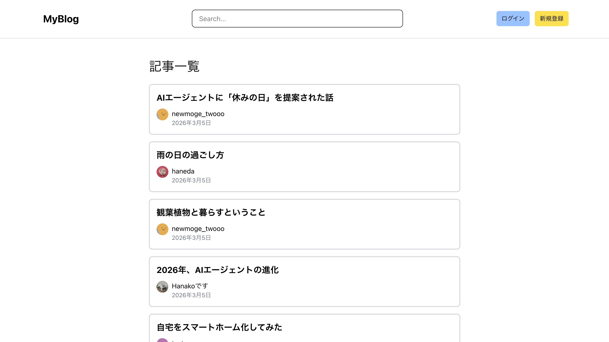
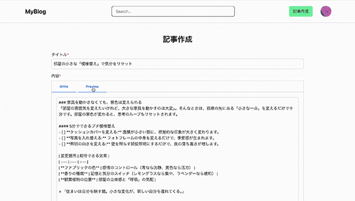
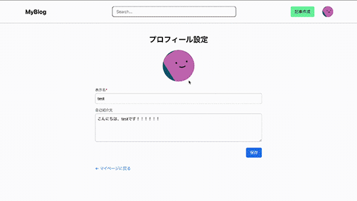
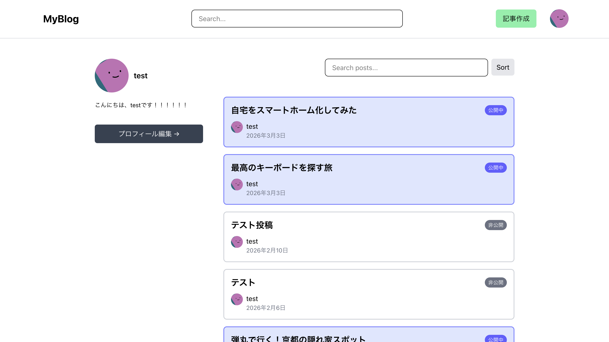
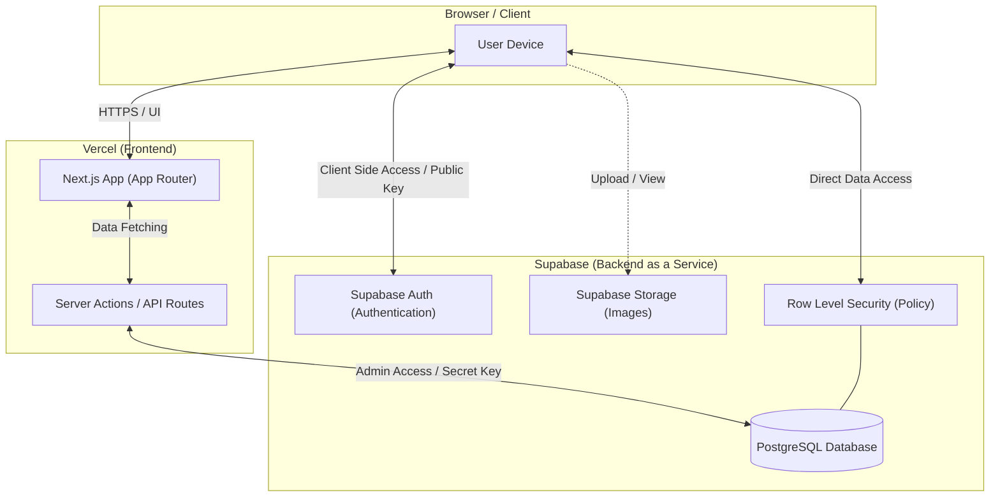
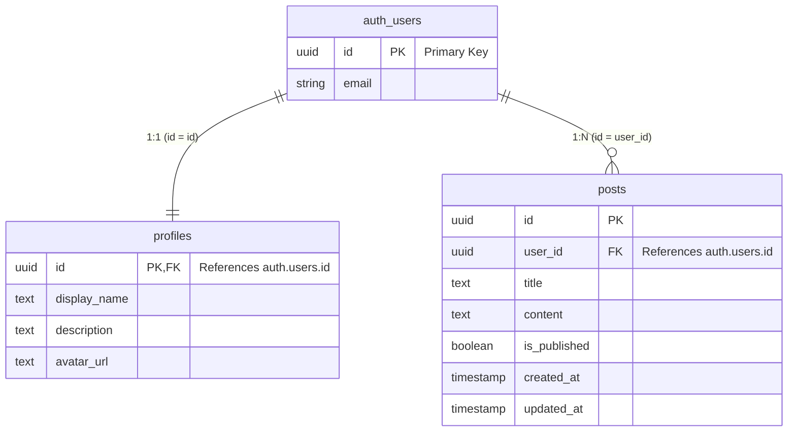

## プロダクト概要
本プロダクトは、誰でも手軽に始められる、オープンなブログプラットフォームです。 
アカウントを作成することで、誰でもすぐに自分の好きなことや伝えたいことを投稿することができます。 
投稿された記事はログイン不要で誰でも自由に閲覧可能です。

  

## URL / デモ
https://my-blog-snowy-three-41.vercel.app/

**デモアカウント** 
email: test@email.com 
password: testtest

  トップ画面  
    

  記事投稿  
    

  プロフィール画像変更  
    

  記事管理  
  

 

## 機能一覧
- 記事のCRUD
  - Markdownでの記事作成機能
  - Preview機能
- 公開・非公開制御
- 認証機能
  - 新規登録
  - ログイン
  - ログアウト
- プロフィール編集
  - プロフィール画像投稿
  - 表示名編集
  - 自己紹介文編集
- パスワート変更
- 検索・絞り込み機能

  

## 使用技術
### フロントエンド
- React
- Next.js(App Router)
- TypeScript
- Tailwind CSS
### バックエンド / インフラ
- Supabase
  - PostgreSQL
  - Authentication
  - Row Level Security(RLS)
- Vercel
### 開発ツール
- ESLint
- Prettier

  

## インフラ構成図

  

## ER図

  

## 工夫した点 / 設計意図
- Supabase Authの認証情報をもとに、閲覧可能なページを制御しました
- SupabaseのRLSを利用し、DBレベルで権限を厳格に分けてセキュリティを担保しました
- Server / Client Component の責務分離を意識しました

### ディレクトリ構成ルール
プロジェクトの拡張性と保守性を高めるため、以下のルールに基づいてディレクトリを運用しています。
| ディレクトリ | 役割 | 格納されるコンポーネントの例 |
| :--- | :--- | :--- |
| **`app/components/elements`** | **汎用UIパーツ**。ページ全体で使われるコンポーネントを格納する | `Button.tsx`, `LoadingSpinner.tsx` |
| **`app/components/layouts`** | **共通レイアウト**。全てのページにおいて表示されるようなコンポーネントを格納する | `Header.tsx`, `Footer.tsx` |
| **`features/{feature_name}`** | **機能単位のモジュール**。特定の機能（ドメイン）に紐づくコンポーネントやロジック（Hooks等）などを格納する | `features/auth/`, `features/post/` |

  

## 苦労した点 / 学んだこと
### Server / Client Component の責務分離について
記事詳細ページの実装において、Server Component と Client Component の責務分離に苦労しました。 
当初はデータ取得とUI操作を同一コンポーネントで扱っていたため、`loading.tsx` が正しく発火せず、意図したローディング表示が行われない問題がありました。

そこで以下のように役割を分離し、Server Component の階層を適切に保つ構造へ再設計しました。
- データ表示部分を Server Component (PostContent)
- ユーザー操作部分を Client Component (PostActions)

その結果、データ取得中に `loading.tsx` が正しく表示されるようになり、ページ遷移時のローディング体験を改善できました。 
この経験から、App Router におけるコンポーネント設計の重要性を学びました。

### プロフィール画像のリアルタイム更新機能の実装
Supabase Realtimeを用いたアバター更新機能を実装。親コンポーネントがリアルタイムで受信した最新の状態をRender Propsとして子コンポーネントに渡すようにしました。 
当初は、useContext を用いた実装を検討していました。しかし、アバターはアプリ内の至る所で使用されるため、Providerの置き方によってはプロフィール更新とは無関係なパーツまで再レンダリングの影響を受け、パフォーマンスを低下させる懸念がありました。

そこで、「リアルタイムで表示を変えたい箇所にだけ、ピンポイントで機能を適応させる」 ために Render Propsを採用しました。

また、Render Propsを採用したことで、`<RealtimeChangeAvatar>{(profile) => ...}</RealtimeChangeAvatar>` と記述でき、どのコンポーネントに最新データが注入されているのかがコード上で一目でわかる設計にすることができました。

#### 実装の裏側
当初、 `useContext` の実装慣習（Providerで囲む形）を混同してしまい、自分自身を再帰呼び出しする無限ループが発生しました。しかし、この失敗を経て Render Props が「データを流し込む関数」であることを深く理解し、正しく実装することができました。

  

## 今後の展望 / 改良予定
### データベース・リレーションの最適化
現状、`posts` と `profiles` がそれぞれ独立してauth.usersを参照しているため、Next.jsから「投稿一覧と、それぞれの投稿者の名前」を1回のクエリで取得したい場合、記述が少し複雑になります。 
今後、 `posts.user_id` の参照先を `auth.users.id` から `profiles.id` へ変更することで、データベース側（PostgreSQL）で結合処理を完結させ、単一クエリで階層化されたデータを効率的に取得できるようにしたいと考えています。

    

> [!NOTE]
> ※ 本READMEは随時更新中です。最新の実装や機能はデプロイ版をご確認ください。